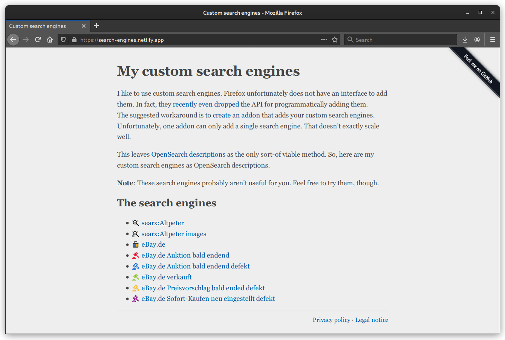

# My custom search engines – Simple list of OpenSearch descriptions

> A simple static website that exposes my custom search engines as OpenSearch descriptions, generated from a simple JSON array.

I like to use custom search engines. Firefox unfortunately does not have an interface to add them. In fact, they [recently even dropped](https://www.fxsitecompat.dev/en-CA/docs/2020/window-external-addsearchprovider-is-now-a-dummy-function/) the API for programmatically adding them.  
The suggested workaround is to [create an addon](https://developer.mozilla.org/en-US/docs/Mozilla/Add-ons/WebExtensions/manifest.json/chrome_settings_overrides) that adds your custom search engines. Unfortunately, one addon can only add a single search engine. That doesn't exactly scale well.

This leaves [OpenSearch descriptions](https://developer.mozilla.org/en-US/docs/Web/OpenSearch) as the only sort-of viable method. So, here are my custom search engines as OpenSearch descriptions.

This repo contains a very simple script that generates a webpage exposing my custom search engines as OpenSearch descriptions. They are generated from the [`engines.json` file](engines.json). Run the script using: `node build.js`  
A live version is available at: [search-engines.netlify.app](https://search-engines.netlify.app/)

My search engines probably aren't useful for you. Feel free to try them, though.

## License

This project is so simple, it likely cannot even be copyrighted. Just in case, I am releasing it under a CC0 license, though. See the [`LICENSE` file](LICENSE) for more details.  
If you have any suggestions, feel free to open an issue or submit a pull request.
